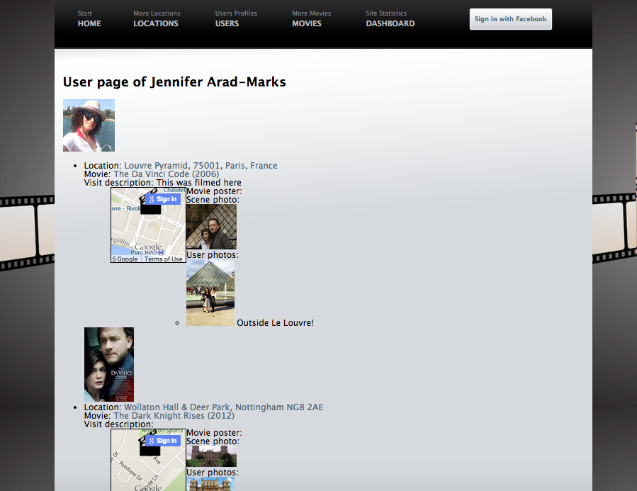

[](https://travis-ci.org/timoxman/Movie-Snaps)

[](https://coveralls.io/r/timoxman/Movie-Snaps)


Movie-Snaps
===================


Collaborators:
-----

[Jennifer Arad-Marks](https://github.com/curlygirly)

[Andy Gout](https://github.com/andygout)

[Ashleigh Maund](https://github.com/ashleigh090990)

[Stefan Lissia](https://github.com/stefan22)

[Tim Oxman](https://github.com/timoxman)

[Daryl Watson](https://github.com/dwatson62)


Brief:
-----

Movie Snaps is a website app you can use to record visits you make to movie locations across the world. You can create new visits, adding a photo (with caption) of yourself re-enacting your chosen scene, which can then be liked and commented upon by other users.

Visitors can search the site and view the visits relating to specific locations, movies and users.


Original pitch:
-----

*Locations where films were shot often prove popular tourist destinations: the Ghostbusters Firehouse in New York; Amelie's Cafe des Deux Moulins in Paris; the Park Hyatt Tokyo where Bob and Charlotte connect whilst Lost In Translation; Hobbiton in New Zealand, to name but a few.*

*As a movie lover, imagine going on holiday and having an app that pinpoints where scenes from your favourite movies were shot, ranging from the biggest blockbusters to more arthouse indie fare.*

*My Movie Holiday uses a user-compiled database of locations that hooks up to a movie API and Google Maps to create an ever-growing worldwide map of places to add to your holiday itinerary.*

*So as to expand the site's community, dedicated users will be able to post photos/videos of themselves at locations re-enacting the iconic scenes once shot there.*


User stories:
-------

```
As a film buff on holiday
So that I can visit famous film locations
I would like to see a map of where they are

As a film aficionado who likes indie films
So that I can share my favorite film locations
I would like to add a clip board marker to the map

As a film lover who loves taking selfies
So that I can log visits to marked film locations
I want to upload them specifying a movie and location with image upload

As a nostalgic
So that I can review all my visits to movie locations
I would like to see a page listing them

As a competitive selfie taker
So that I can compare my reenactment photos
I would like to see a listed display of other users' photos

As an obsessive social media user
So that I can support my selfie loving friends
I would like to 'like' their fab film selfies

As an obsessive social media user
So that I can support my selfie loving friends
I would like to comment or how awsome their pics are

As a visitor to a particular location
So that I can view visits info/photos relating to that location
I would like to see a listed display

As a fan of a particular movie
So that I can view visits info/photos relating to that movie
I would like to see a listed display

As a fan of a particular scene in a movie
So I can view visits info/photos relating to that scene
I would like to see a listed display

As a movie snaps admin
So that I can protect my users and monitor content
I would like users to be signed in to upload pictures and contribute

As a movie snap admin
So that that I can entice new users
I would like to the homepage to display user visits info/photos
```

Technologies Used:
-------

* Ruby on Rails web application framework
* ActiveRecord (database query interface) with PostgreSQL database
* Javascript
* jQuery
* Tested with RSpec, Capybara, Poltergeist headless browser on Selenium Driver
* Photos saved to Amazon Web Services: S3 (Simple Storage Service)
* API calls made to GoogleMaps and OMDb API (The Open Movie Database)


Set-up Steps:
-----

This README would normally document whatever steps are necessary to get the
application up and running.

Things you may want to cover:

* Ruby version

* System dependencies

* Configuration
    Rails should be installed via the cmd: gem install rails
    To get this application up and running, pull the repo from Github. Add a file called .env to your route directory. (This file is not in the github repo because it's in the gitignore file)
    To this new file add two lines:
      FACEBOOK_APP_ID=
      FACEBOOK_APP_SECRET=
      Complete the 2 lines with the app ID and App secret which are added in the slack channel. (no spaces between = and ID's)

* Database creation
    bin/rake db:create
    or bin/rake db:migrate (if you have a previous version of the app)

* Database initialization

* How to run the test suite
    $ rspec

* To See test system
    bin/rails s
    go to http://localhost:3000/

* Services (job queues, cache servers, search engines, etc.)

* Deployment instructions
    tba


Please feel free to use a different markup language if you do not plan to run
<tt>rake doc:app</tt>.


Live demo on Heroku:
-------

[Movie-Snaps](https://movie-snaps.herokuapp.com/)


Images:
-------

- Welcome Page


- User Show Page


- Location Show Page


- Movie Show Page


Links:
-------

[OMDb API](http://www.omdbapi.com/)